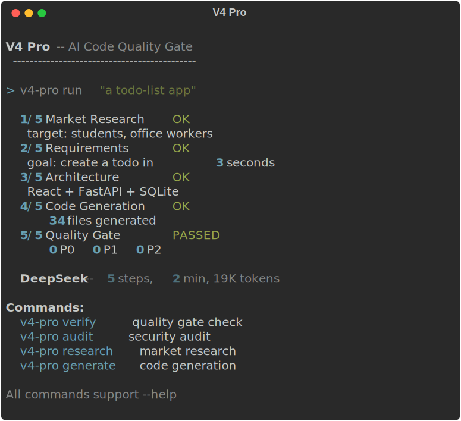

<div align="center">

# 🛡️ V4 Pro

**AI 编程质量门禁 · AI Code Quality Gate**

*把 AI 写的代码从「能跑就行」升级到「可直接上线」*

*Upgrade AI-generated code from "it works" to "production-ready"*

[]()
[]()
[](https://github.com/yn400/v4-pro/actions/workflows/ci.yml)
[]()
[](https://github.com/yn400/v4-pro/releases)

---

</div>

## 📋 简介 · Overview

**中文**：V4 Pro 是一个 AI 编程质量门禁工具。当你用 AI（Claude、GPT、DeepSeek 等）生成代码后，V4 Pro 会自动对你的代码进行**静态分析、安全扫描、架构合规检查**，把 AI 代码中隐藏的 bug、安全漏洞、架构问题揪出来。支持 5 步全流程（研究→定义→设计→生成→验证），也支持当成独立质量门禁对已有代码使用。

**English**: V4 Pro is an AI Code Quality Gate. After AI generates your code, V4 Pro automatically runs **static analysis, security scanning, and architecture compliance checks** to catch bugs, vulnerabilities, and design issues before they ship. Use it as a full 5-step pipeline or as a standalone quality gate for any codebase.

---

## 🎯 核心亮点 · Key Features

| 中文 | English |
|------|---------|
| 🛡️ **质量门禁** — 一键检测 AI 代码的常见问题 | **Quality Gate** — One-click check for AI code issues |
| 🔐 **安全审计** — 覆盖 OWASP Top 10 的 6+ 类漏洞 | **Security Audit** — Covers 6+ OWASP Top 10 categories |
| 🤖 **PR 自动检查** — PR 提交自动跑质量门禁 | **PR Check** — Auto quality gate on every PR |
| 🐳 **Docker 版** — 一行命令即用 | **Docker** — `docker run ghcr.io/yn400/v4-pro` |
| 🧊 **防腐蚀** — 冻结架构规范，后续生成不跑偏 | **Anti-Decay** — Freeze architecture specs as ratchet |
| 📦 **预设模板** — 4 种项目类型开箱即用 | **Presets** — 4 project templates ready |
| 🔄 **多 LLM 支持** — OpenAI / 智谱 / 通义 / Claude | **Multi-LLM** — OpenAI, Zhipu, Qwen, Claude |
| 📊 **丰富报告** — Rich 终端渲染 + JSON 导出 | **Rich Reports** — Beautiful terminal output + JSON export |

---

## 🖥️ 演示 · Demo



---

## 🚀 快速开始 · Quick Start

### 🐳 方案 A：Docker（最快，无需安装 Python）

```bash
# 对当前目录下的代码跑质量门禁
docker run --rm -v $(pwd):/code ghcr.io/yn400/v4-pro verify --code /code
```

### 📦 方案 B：pip 安装

```bash
# 需要 Python ≥ 3.10
pip install v4-pro

# 使用
v4-pro --help
```

### 🔧 方案 C：源码安装

```bash
git clone https://github.com/yn400/v4-pro.git
cd v4-pro
pip install -e ".[dev]"
```

### ⚙️ 配置

```bash
cp .env.example .env
# 编辑 .env，填入你的 API Key（仅 run/research/design/generate 需要）
```

---

## 💡 使用方式 · Usage

### 方式一：一键全流程（推荐）

```bash
v4-pro run "做一个待办事项 App"
# 一句话：市场研究 → 需求定义 → 架构设计 → 代码生成 → 质量门禁
```

### 方式二：分步执行

```bash
v4-pro research "做一个二手交易平台"    # Step 1: 市场研究
v4-pro define                           # Step 2: 需求定义
v4-pro design                           # Step 3: 架构设计
v4-pro generate                         # Step 4: 代码生成
v4-pro verify                           # Step 5: 质量门禁
```

### 方式三：对已有代码做质量检查

```bash
# 质量门禁（无需 API Key）
v4-pro verify --code ./my-project/src/

# 安全审计（OWASP Top 10）
v4-pro audit --code ./my-project/src/

# JSON 格式导出
v4-pro audit --code ./src/ --format json --output audit-report.json
```

---

## 🤖 PR 质量门禁 · PR Quality Gate

将 V4 Pro 集成到你的 GitHub PR 流程中，每次提交自动检查代码质量：

```yaml
# .github/workflows/v4-pro-gate.yml
name: V4 Pro Quality Gate
on: [pull_request]
jobs:
  quality-gate:
    uses: yn400/v4-pro/.github/workflows/pr-check.yml@main
```

效果：PR 提交时自动跑 `v4-pro verify`，有 P0 问题直接阻断合并。

---

## 📦 预设模板 · Presets

开箱即用的项目类型预设：

| 模板 | 文件 | 适合 |
|------|------|------|
| 🌐 Web 应用 | `presets/web-app.json` | React + FastAPI + PostgreSQL |
| 📦 Python 包 | `presets/python-package.json` | 库项目 |
| 🔧 嵌入式/IoT | `presets/embedded-iot.json` | ESP32 / STM32 / Arduino |
| 📱 移动应用 | `presets/mobile-app.json` | React Native / Flutter |

用法：

```bash
v4-pro run "做一个 IoT 传感器平台" --preset presets/embedded-iot.json
```

---

## 📊 命令一览 · Command Reference

| 命令 · Command | 说明 · Description |
|----------------|-------------------|
| `v4-pro run <需求>` | 一键全流程（推荐） |
| `v4-pro research <需求>` | 市场研究与竞品分析 |
| `v4-pro define` | 需求定义与功能规划 |
| `v4-pro design` | 架构设计与技术选型 |
| `v4-pro generate` | AI 代码生成 |
| `v4-pro verify` | **质量门禁**（静态分析+安全+架构） |
| `v4-pro audit` | **安全审计**（OWASP Top 10） |
| `v4-pro freeze` | 冻结架构规范，防止代码腐化 |
| `v4-pro init` | 初始化项目脚手架 |
| `v4-pro --help` | 显示帮助 |

---

## 🔬 真实审计输出 · Real Audit Example

V4 Pro 自带安全审计功能。以下是对 **V4 Pro 自身代码**的安全审计结果（v4_pro 审计 v4_pro）：

```
$ v4-pro audit --code ./v4_pro/ --format json

扫描 21 个文件:
  Critical:  5  — 不安全反序列化检测规则
  High:      6  — 路径遍历、HTTP明文
  Medium:    8  — 日志泄露、弱随机数
  Risk Score: 96/100

✓ V4 Pro 会如实报告自身的所有问题——包括审计器本身的误报模式。
  (临界问题全部来自 scanner.py 中的规则匹配模式，而非实际漏洞)
```

---

## 🏗️ 项目结构 · Project Structure

```
v4-pro/
├── v4_pro/                     # 核心代码
│   ├── cli.py                  # CLI 入口
│   ├── engine.py               # 工作流引擎
│   ├── config.py               # 配置管理
│   ├── engine.py               # 工作流引擎
│   ├── llm/                    # LLM 适配器层
│   ├── verify/                 # 质量门禁
│   ├── audit/                  # 安全审计
│   └── freeze/                 # 冻结规范管理
├── presets/                    # 项目类型预设
├── tests/                      # 56 个单元测试
├── Dockerfile                  # 容器化部署
├── CHANGELOG.md
├── pyproject.toml
├── LICENSE
└── README.md
```

---

## 🧪 测试 · Tests

```bash
# 全部 56 个测试
python -m pytest

# 带覆盖率
python -m pytest --cov=v4_pro --cov-report=term

# 仅安全扫描测试
python -m pytest tests/test_security_scan.py -v
```

---

## 🔧 支持的 LLM

| Provider | 配置值 | 说明 |
|----------|--------|------|
| OpenAI / 中转站 | `openai` | 兼容任意 OpenAI 格式 API |
| 智谱 GLM | `zhipu` | 国内直连，无需代理 |
| 通义千问 Qwen | `tongyi` | 阿里云，国内直连 |
| Claude | `anthropic` | 即将支持 |

---

## 📄 CHANGELOG

[CHANGELOG.md](CHANGELOG.md) — 版本历史与更新记录。

---

## 📄 协议 · License

[MIT](LICENSE) — 自由使用、修改、商用。

---

<div align="center">

**如果 V4 Pro 帮到了你，点个 ⭐ 吧！**

*If V4 Pro helps you, give it a ⭐!*

[GitHub](https://github.com/yn400/v4-pro) · [Issues](https://github.com/yn400/v4-pro/issues)

</div>
